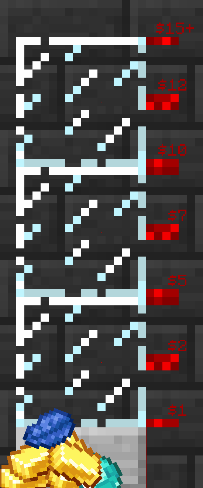

## Welcome to the CringeServer pages!

### Donations

I have made a meter for donations, to track our progress! Our current goal, as you can see, is 15$/month. Once we get that, I'll
be able to afford to run the server with better performance, as well as host a new server for modded or vanilla+ gameplay!

Good luck! Let's hope we reach the top.

Donate here:

### CringeServer Packs!

#### For the resource pack:
Go to: 'packs/latest.zip' for the latest server resource pack.

#### For the client-side modpack:
You should be able to fetch the latest client-side modpack from 'modpack/latestModpack.zip' (Unzip it into your .minecraft directory to install it)

## It's easy as 1 2 3!
